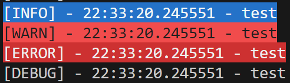

# PythonModules

Ce module contient plusieurs utilitaires pour mes développements persos.

## time_this_function

Cet utilitaire est un décorateur qui permet d'indiquer combien de temps l'exécution d'une fonction a duré.

```python
from time_this_function import time_this_function

@time_this_function
def foo():
    print("foo")
```

Ce module utilise le module [Logger](#logger)

## Logger

Ce module permet d'afficher plusieurs types de logs:

- debug -> pour les développeurs
- info -> à titre d'information
- warn -> pour prévenir d'un comportement potentiellement indésirable
- error -> pour indiquer qu'une erreur est surevenue



```python
from logger import Logger

LOGGER = Logger()

LOGGER.debug("Un message pour les devs")
LOGGER.info("Un message d'information")
LOGGER.warn("Comportement potentiellement indésirable")
LOGGER.error("Une erreur est survenue")
```

La gestion des exceptions n'est pas encore gérée.
